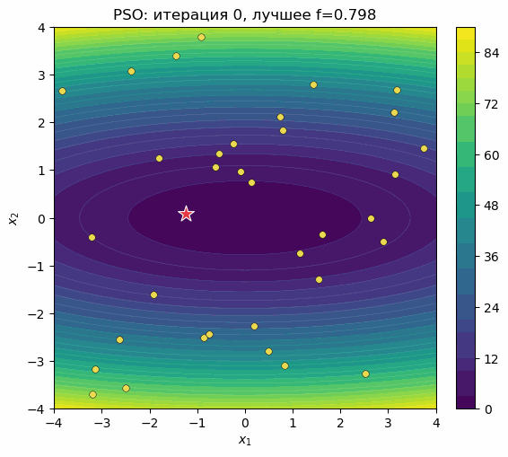
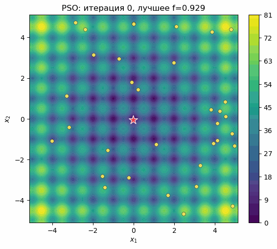
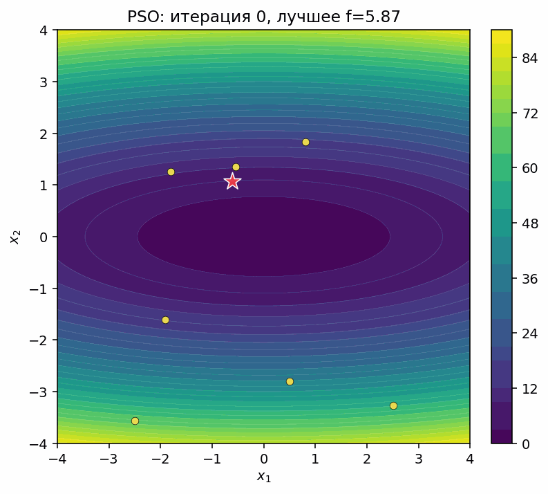
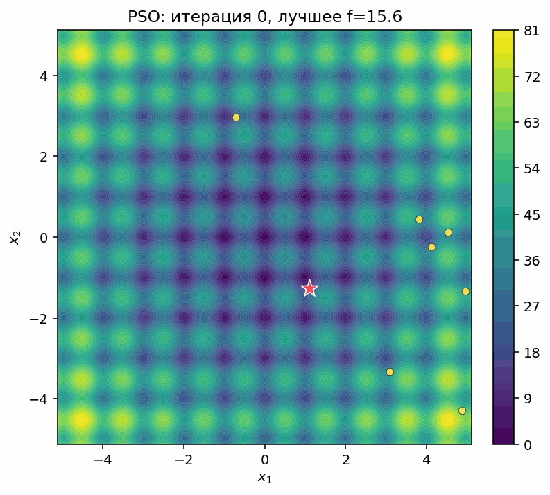
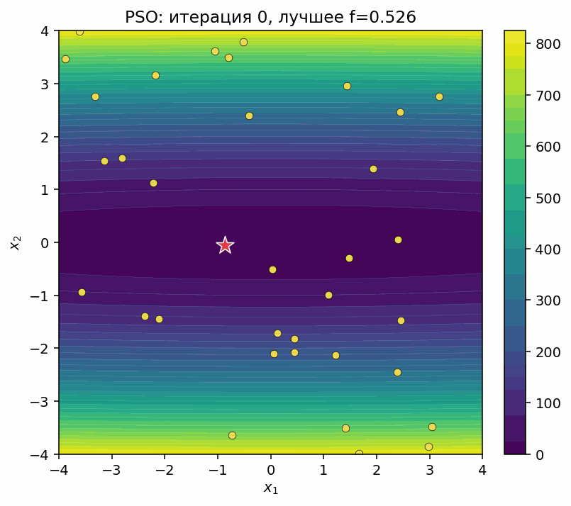
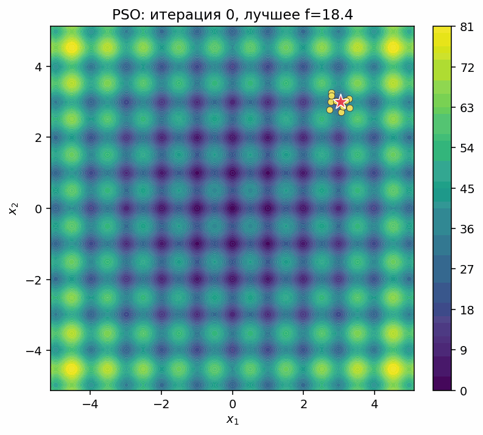
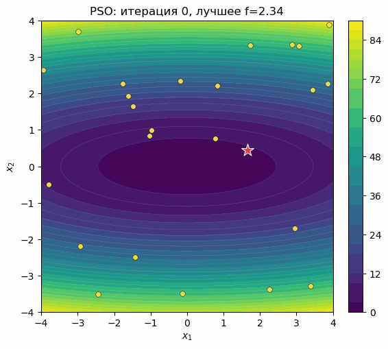
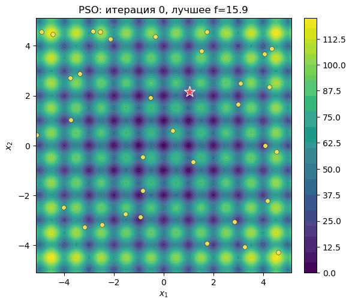

# Метод роя частиц (Particle Swarm Optimization)

Материалы доклада по курсу **«Численные методы»**, прочитанного 25 апреля 2026 года.

Автор: Ластовецкий Дмитрий, Университет ИТМО, институт математики.

Репозиторий содержит воспроизводимую реализацию Particle Swarm Optimization (PSO), демонстрационный notebook, Beamer-презентацию и иллюстрации к экспериментам на квадратичной функции и функции Растригина.

## Что внутри

- `src/pso_core.py` — ядро алгоритма PSO, тестовые функции и метрики.
- `notebooks/pso_demo.ipynb` — самостоятельный notebook с формулами, экспериментами, таблицей результатов и графиками.
- `scripts/generate_assets.py` — генерация PNG/GIF-иллюстраций и `assets/experiment_summary.json`.
- `tex/slides.tex` — исходник презентации.
- `tex/slides.pdf` — полная PDF-версия слайдов.
- `assets/` — готовые изображения и GIF-анимации для README и презентации.

## Анимации

| Квадратичная функция | Функция Растригина |
| --- | --- |
|  |  |
|  |  |
|  |  |
|  |  |

## Быстрый старт

```bash
python3 -m venv .venv
source .venv/bin/activate
pip install -r requirements.txt
```

Открыть notebook:

```bash
jupyter lab notebooks/pso_demo.ipynb
```

Перегенерировать изображения, GIF и сводку экспериментов:

```bash
make assets
```

Собрать презентацию:

```bash
make slides
```

Готовый PDF создается как `tex/slides.pdf` и хранится в репозитории. Анимации в PDF сделаны через пакет `animate`; они обычно воспроизводятся в Adobe Acrobat Reader и могут не работать во встроенном просмотрщике браузера или Preview на macOS.

Для сборки слайдов нужны `latexmk`, XeLaTeX и Biber. Полная сборка ассетов и презентации:

```bash
make all
```

## Основная идея

PSO хранит лучший личный опыт каждой частицы и лучший результат всего роя. На каждом шаге частица смешивает инерцию, притяжение к своему лучшему положению и притяжение к лучшему положению роя:

```math
v_i^{t+1}=\omega v_i^t+c_1 r_{1,i}^t(p_i^t-x_i^t)+c_2 r_{2,i}^t(g^t-x_i^t),
```

```math
x_i^{t+1}=\Pi_D(x_i^t+v_i^{t+1}).
```

В notebook показано, как размер роя, обусловленность функции, параметры притяжения и начальная область влияют на скорость и качество сходимости.
